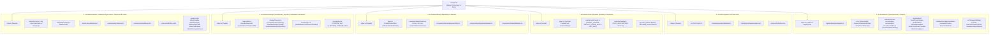

# 🗺️ BestNotes Master Codebase Index & Domain Architecture Guide (`v1.02 — heatSimFixed`)

> **Σκοπός:** Αυτό το έγγραφο αποτελεί τον κεντρικό χάρτη πλοήγησης (Code Index) του BestNotes / ExplainBoards. Καταγράφει αναλυτικά πού βρίσκεται κάθε λειτουργία, πώς οργανώνονται τα domains (`src/simulations/`, `src/stem-engines/`, `src/canvas-tools/`, `src/features/library/`, `src/services/storage/`, `src/features/admin/`), πώς αποσυντίθεται το `src/App.tsx` και το `src/utils/geometryAndAlgorithms.ts`, και πώς γίνεται το code-splitting ώστε οποιοσδήποτε προγραμματιστής ή AI agent να εντοπίζει ακαριαία τον κώδικα.

---

## 🏛️ Οι 6 Βασικοί Πυλώνες (Domain-Driven Architecture)

```mermaid
graph TD
    App["src/App.tsx<br/>(Master Orchestrator & State)"]
    
    subgraph D1["1. src/simulations/ (Προσομοιώσεις & Physics)"]
        SimIndex["index.ts (Facade & Registry Init)"]
        SimRegistry["registry/SimulationRegistry.ts"]
        SimCore["core/ (PhysicsMath, UniversalStopwatchBridge, VirtualPencilAnimator)"]
        SimCircuits["modules/circuits/ (circuitEngine, circuitHelpers, CircuitControlPanel, CircuitSimulationModule)"]
        SimHeat["modules/heat/ (heatPhysicsEngine, HeatRenderer, useHeatSimulation, HeatControlPanel, Modals, SketchRecognizer)"]
        SimPendulum["modules/mechanics/pendulum/ (pendulumPhysics, PendulumModule)"]
        SimUI["ui/ (StopwatchWidget 1x/2x/5x, FullscreenLaserCanvas, SimulationObjectRibbon)"]
    end
    
    subgraph D2["2. src/stem-engines/ (STEM & OCR)"]
        StemIndex["index.ts (Facade)"]
        StemOCR["ocr/OcrPrompts.ts"]
        StemChem["chemistry/periodicTableData.ts"]
        StemMath["math/physicsEquationsLibrary.ts"]
        StemUI["ui/LassoOcrButtons.tsx"]
    end

    subgraph D3["3. src/canvas-tools/ (Εργαλεία Σχεδίασης & Χρώματα)"]
        CanvasIndex["index.ts (Facade)"]
        CanvasTypes["types.ts (ToolType, PenSubType, EraserSubType)"]
        CanvasPalette["palette/colorPresets.ts (PRESET_COLORS, DEFAULT_COLOR_SLOTS, APP_NAVY)"]
        CanvasCatalog["tools/toolCatalog.ts (TOOL_DESCRIPTORS, shortcuts)"]
        CanvasGeom["geometry/ (Bezier Splines, Smoothing, Graph Strokes)"]
    end

    subgraph D4["4. src/features/library/ (Βιβλιοθήκη & Φάκελοι)"]
        LibIndex["index.ts (Facade)"]
        LibTypes["types.ts (CustomFolderMeta, EditingFolderModalState)"]
        LibPresets["constants/folderPresets.tsx (Colors, 30 Icons, renderFolderCustomIcon)"]
        LibRecent["components/RecentlyOpenedStrip.tsx"]
        LibDelModal["components/LibraryDeleteModal.tsx"]
        LibFolderModal["components/FolderEditModal.tsx"]
    end

    subgraph D5["5. src/services/storage/ (Αποθήκευση, Συμπίεση, IndexedDB & Firestore)"]
        StorIndex["index.ts (Facade)"]
        StorIDB["indexedDb.ts (openBestNotesIdb, saveNotebooksToIndexedDB)"]
        StorClean["storageCleaners.ts (compactStrokeForStorage, cleanNotebookForStorage, serializeNotebookForFirestore)"]
        StorSync["firestoreSync.ts (saveNotebookToFirestoreChunked)"]
        StorKeys["storageKeys.ts (STORAGE_KEY, UI_SESSION_STORAGE_KEY)"]
    end

    subgraph D6["6. src/features/admin/ (Πίνακας Ελέγχου Admin, Τηλεμετρία & Traffic)"]
        AdminIndex["index.ts (Facade)"]
        AdminPortal["AdminPortal.tsx (Lazy Code-Split Gate & Suspense)"]
        AdminDash["AdminDashboard.tsx (Master View)"]
        AdminRouteHook["hooks/useAdminRoute.ts"]
        AdminTelemHook["hooks/useAppTelemetry.ts"]
        AdminStats["services/userStatsService.ts"]
        AdminTraffic["services/trafficService.ts"]
        AdminViews["components/ (AdminSidebar, AdminKpiCards, AdminUsersTable, AdminTrafficView, AdminOcrAnalyticsView)"]
    end

    App --> SimIndex
    App --> StemIndex
    App --> CanvasIndex
    App --> LibIndex
    App --> StorIndex
    App --> AdminIndex
```

---

## 📦 Αναλυτικός Πίνακας Ευρετηρίου Αρχείων (File & Symbol Index)

### 1. Domain: Προσομοιώσεις Φυσικής & Εργαστηρίου (`src/simulations/`)

| Υποενότητα | Αρχείο | Ρόλος & Βασικές Εξαγωγές | Τι Απομόνωσε / Βελτιστοποίησε |
| :--- | :--- | :--- | :--- |
| **Facade & Core** | `src/simulations/index.ts` | Master Facade export & αυτόματη εγγραφή των `PendulumModule`, `HeatSimulationModule`, `CircuitSimulationModule` | Ενοποιημένο import στο `App.tsx` |
| | `src/simulations/types.ts` | `ISimulationModule`, `SimulationCategory`, `SimulationObjectItem`, `Vector2D`, `StopwatchAction` | Τύποι προσομοιώσεων |
| | `src/simulations/core/PhysicsMath.ts` | 2D διανυσματικά μαθηματικά (`add`, `sub`, `scale`, `dot`, `cross`, `norm`, `lerp`, `clamp`) | Επαναχρησιμοποιήσιμη μηχανή διανυσμάτων |
| | `src/simulations/core/UniversalStopwatchBridge.ts` | Pub/Sub bridge για συγχρονισμό χρονομέτρου με προσομοιώσεις (`dispatchAction`, `subscribe`) | Αποσύζευξη UI χρονομέτρου |
| | `src/simulations/core/VirtualPencilAnimator.ts` | Βηματική σχεδίαση με κινούμενο μολυβάκι (Pencil PNG) στον καμβά | Μηχανή αυτόματης σχεδίασης |
| | `src/simulations/registry/SimulationRegistry.ts` | Plug-and-play Registry (`register`, `get`, `listByCategory`) | Κεντρική καταγραφή προσομοιώσεων |
| **Ηλεκτρικά Κυκλώματα (`modules/circuits/`)** | `src/simulations/modules/circuits/index.ts` | Barrel export για όλη τη Μηχανή Κυκλωμάτων | Πλήρης αυτονομία κυκλωμάτων |
| | `src/simulations/modules/circuits/types.ts` | `CircuitComponentKind`, `CircuitComponentInfo`, `HandDrawnCircuitRecognitionResult`, `SimulatedWireSegment`, `SimulatedComponentState`, `AutoVerticalSwitchInfo`, `CircuitSimulationData`, `CircuitSimConfig` | Όλοι οι τύποι κυκλωμάτων |
| | `src/simulations/modules/circuits/circuitEngine.ts` | `classifyCircuitStrokeKind`, `getCircuitComponentsWithTerminals`, `repairCircuitMeterStrokes`, `splitWiresUnderCircuitComponent`, `getCircuitWireRailSnapDelta`, `adaptCircuitWiresOnScaleTransform`, `adaptCircuitWiresOnComponentMove`, `toggleSwitchStrokeGroup`, `recognizeHandDrawnCircuitSymbols`, `autoAlignAndConnectCircuit`, `convertCircuitComponents`, `analyzeCircuitForSimulation` (με **LRU Memoization Cache** `O(1)` για αμετάβλητα strokes) | Αφαίρεση **7.138 γραμμών** από το `geometryAndAlgorithms.ts` + `O(1)` cache στον επιλυτή Kirchhoff |
| | `src/simulations/modules/circuits/circuitHelpers.ts` | `getValidCircuitSims`, `getAllNotebookCircuitSims`, `getActiveCircuitSim`, `getNextDefaultCircuitSimName`, `isCircuitEligibleStroke`, `areStrokesWithinCircuitTol`, `getSimExpandedStrokeSet`, `expandWholeCircuitStrokeIds`, `runScopedCircuitOperationOnPage`, `splitWiresAndSyncPageSims` | Αφαίρεση **335 γραμμών** από το `App.tsx` |
| | `src/simulations/modules/circuits/CircuitControlPanel.tsx` | Πλήρες Dashboard UI για τα Ηλεκτρικά Κυκλώματα (επιλογέας `sim01`/`sim02` με φωτεινή ένδειξη ON/OFF, Play/Pause, `Ένωση`, `Ολοκλήρωση`, Αποδοχή/Ακύρωση πρότασης, διακόπτης, μετατροπή `Σχήματα ↔ Σύμβολα`, φορά ηλεκτρονίων/συμβατική, ταχύτητα) | Αφαίρεση **775 γραμμών** inline JSX από το `App.tsx` |
| | `src/simulations/modules/circuits/CircuitSimulationModule.ts` | `CircuitSimulationModule` & `CIRCUIT_OBJECT_CATALOG` (8 εξαρτήματα κυκλώματος) | Εγγραφή στο `SimulationRegistry` |
| **Θερμότητα & Θερμοδυναμική (`modules/heat/`)** | `src/simulations/modules/heat/index.ts` | Barrel export για όλη την ενότητα Θερμότητας | Πλήρης αυτονομία Θερμότητας |
| | `src/simulations/modules/heat/types.ts` | `HeatSimConfig`, `HeatObject`, `HeatObjectType`, `LiquidType`, `LIQUID_REGISTRY` (Νερό, Γάλα, Ελαιόλαδο), `HeatContainerState`, `HeatBurnerState`, `HeatTripodState`, `HeatThermometerState`, `HeatGraphConfig` | Μοντέλα δεδομένων Θερμότητας |
| | `src/simulations/modules/heat/heatPhysicsEngine.ts` | Θερμιδική ισορροπία με ενεργειακά συνεπή μονοτονική σύγκλιση ($\theta_i(t+\Delta t) = \theta_{\text{eq}} + (\theta_i(t) - \theta_{\text{eq}})e^{-\lambda\Delta t}$), Νόμος Ψύξης Νεύτωνα προς $\theta_{\text{περιβάλλοντος}}$, βρασμός, εξάτμιση & decimation ιστορικού γραφήματος | Φυσική μηχανή Θερμότητας |
| | `src/simulations/modules/heat/HeatRenderer.ts` | 2.5D rendering (Καμινέτο, Τρίποδας, Ποτήρι, Λεκάνη, Κωνική Φιάλη, Θερμόμετρο, Γράφημα $\theta - t$), χρωματική κωδικοποίηση ένθετων δοχείων (`Α` μαύρο, `Β` μωβ `#7c3aed`, `Γ` πράσινο `#16a34a`, `Δ` κόκκινο `#dc2626`), offscreen blur caching (`renderWithOffscreenBlurCache`), viewport culling (`getHeatSimulationWorldBounds`), idle deduplication (`isHeatSimulationVisuallyActive`), απόκρυψη δεξιών κουμπιών κατά την επιλογή, και hover badges υγρού (`500ml Νερό`) στη σταγόνα (`💧`) και στη μύτη του δοχείου | Υψηλής απόδοσης 120fps Canvas 2D renderer |
| | `src/simulations/modules/heat/useHeatSimulation.ts` | Κεντρικό React hook διαχείρισης αντικειμένων, μαγνητικού κουμπώματος, resize/stretch handles, multi-select, copy/paste, z-order και physics frame stepping | State & pointer interactions Θερμότητας |
| | `src/simulations/modules/heat/HeatControlPanel.tsx` | Dashboard Θερμότητας (Play/Pause, Reset, Χρονόμετρο, Διάγραμμα $\theta - t$, Θερμοκρασία Περιβάλλοντος $0\text{–}50^\circ\text{C}$, Εργαστηριακός εξοπλισμός & Οδηγός) | UI ελέγχου Θερμότητας |
| | `src/simulations/modules/heat/HeatLiquidConfigModal.tsx` | Modal ρύθμισης υγρού (Νερό/Γάλα/Ελαιόλαδο), όγκου ($\text{ml}$) και αρχικής θερμοκρασίας ($\theta_0$) | Modal ιδιοτήτων δοχείου |
| | `src/simulations/modules/heat/HeatGraphChoiceModal.tsx` | Modal επιλογής προσθήκης καμπύλης σε υπάρχον διάγραμμα ή δημιουργίας νέου διαγράμματος | Modal διαγραμμάτων $\theta - t$ |
| | `src/simulations/modules/heat/HeatSketchRecognizer.ts` | Αναγνώριση χειρόγραφου σκίτσου (καμινέτο, τρίποδας, ποτήρι, λεκάνη, κωνική φιάλη, θερμόμετρο) | Sketch-to-Sim Θερμότητας |
| | `src/components/PageHeatSimsThumbCanvas.tsx` | Component απόδοσης προσομοιώσεων Θερμότητας στις μικρογραφίες της Βιβλιοθήκης και του Πλέγματος Σελίδων | Live thumbnails Θερμότητας |
| **Μηχανική (`modules/mechanics/`)** | `src/simulations/modules/mechanics/pendulum/` | `PendulumModule.ts` & `pendulumPhysics.ts` ($T = 2\pi\sqrt{L/g}$, τάση νήματος $T = mg(3\cos\theta - 2\cos\theta_{\max})$, συντεταγμένες, 1-click εκκίνηση/παύση από ακραία θέση) | Φυσική & παραμετροποίηση εκκρεμούς |
| **UI Widgets (`ui/`)** | `src/simulations/ui/StopwatchWidget.tsx` | Ψηφιακό Χρονόμετρο με dual-corner resize, κουμπί επιτάχυνσης χρόνου **`1x` → `2x` → `5x`** στην επικεφαλίδα, και persistence στο `localStorage` | Αυτόνομο widget χρονομέτρου |
| | `src/simulations/ui/FullscreenLaserCanvas.tsx` | Ανεξάρτητος καμβάς κόκκινου laser (`z-[100000]`) με presentation lock | Καμβάς παρουσίασης |
| | `src/simulations/ui/SimulationObjectRibbon.tsx` | Swipeable οριζόντια μπάρα αντικειμένων προσομοίωσης | Κοινή μπάρα αντικειμένων |

---

### 2. Υπόλοιπα Domains (`src/stem-engines/`, `src/canvas-tools/`, `src/features/`, `src/services/`)

| Domain | Αρχείο | Ρόλος & Βασικές Εξαγωγές |
| :--- | :--- | :--- |
| **STEM & OCR** | `src/stem-engines/index.ts` | Master Facade export για STEM, Χημεία, Φυσική & OCR |
| | `src/stem-engines/ocr/OcrPrompts.ts` | System prompts για Ελληνικό χειρόγραφο, LaTeX, Χημικές Εξισώσεις, 3D Μόρια |
| | `src/stem-engines/chemistry/periodicTableData.ts` | Περιοδικός πίνακας, Bohr models, χημικές εξισώσεις |
| | `src/stem-engines/math/physicsEquationsLibrary.ts` | Κατάλογος εξισώσεων φυσικής ελληνικού αναλυτικού προγράμματος |
| | `src/stem-engines/ui/LassoOcrButtons.tsx` | Κορδέλα 3 κουμπιών OCR (`Text OCR`, `Σ Math ▾`, `⚗ Chem ▾`) |
| **Canvas Tools & Fonts** | `src/canvas-tools/index.ts` | Master Facade export για εργαλεία σχεδίασης και παλέτες |
| | `src/canvas-tools/palette/colorPresets.ts` | `PRESET_COLORS`, `DEFAULT_COLOR_SLOTS`, `THICKNESS_PRESETS`, `APP_NAVY` |
| | `src/canvas-tools/tools/toolCatalog.ts` | `TOOL_DESCRIPTORS` & helper queries |
| | `public/fonts/ExplainBoards*.otf` | Ενσωματωμένες ελληνικές γραμματοσειρές: `Καλλιγραφική` (`ExplainBoards Calligraphic`), `Πένα` (`ExplainBoards Pena`), **`Fun`** (`ExplainBoards Fun` & `FunBold`), **`Diary`** (`ExplainBoards Diary` & `DiaryBold`) με οριζόντιο swipe 4 γραμματοσειρών στην πάνω μπάρα |
| **Library** | `src/features/library/index.ts` | Master Facade export για τη βιβλιοθήκη και τους φακέλους (`RecentlyOpenedStrip`, `LibraryDeleteModal`, `FolderEditModal`, `folderPresets`) |
| | `src/components/LibraryNoteMiniThumb.tsx` | Κάρτα προεπισκόπησης σημειωματάριου στη Βιβλιοθήκη (περιλαμβάνει `PageStrokesThumbCanvas` + `PageHeatSimsThumbCanvas`) |
| **Storage, Compression & Sync** | `src/services/storage/storageCleaners.ts` | `compactStrokeForStorage` (**Lossless συμπίεση σημείων 240Hz Apple Pencil / GoodNotes κατά 55%–70%** + στρογγυλοποίηση `0.1px`), `cleanNotebookForStorage`, `serializeNotebookForFirestore`, `cleanNotebookForLibraryCache`, `getNotebookContentScore` |
| | `src/services/storage/indexedDb.ts` | `openBestNotesIdb`, `saveNotebooksToIndexedDB`, `loadNotebooksFromIndexedDB` |
| | `src/services/storage/localAndIdbSync.ts` | `saveCustomFoldersToLocalAndIdb`, `saveNotebooksToLocalAndIdb`, `saveLibraryShelfCache` |
| | `src/services/storage/firestoreSync.ts` | `saveNotebookToFirestoreChunked`, `getMonotonicIsoTimestamp` |
| **Seeds & Importers** | `src/data/seeds/index.ts` | 11 έτοιμα εκπαιδευτικά τετράδια (απομονωμένα στο δικό τους chunk `data-seeds`) |
| | `src/utils/goodnotesParser.ts` | Native `.goodnotes` (ZIP + Protobuf + `bv41` LZ4) & `.bestnotes` parser με αυτόματη συμπίεση `compactStrokeForStorage` |
| | `src/utils/pdfAndImageImporter.ts` | PDF & Image importer με adaptive DPI και local IndexedDB caching |
| **Admin & Telemetry** | `src/features/admin/index.ts` | Απομονωμένο Admin Portal (`AdminPortal.tsx`, `AdminDashboard.tsx`, `useAdminRoute`, `useAppTelemetry`, `userStatsService`, `trafficService`) |
| **Bundling & Code Splitting** | `vite.config.ts` | Έξυπνος διαχωρισμός σε 9 ανεξάρτητα chunks: `vendor-react`, `vendor-firebase`, `vendor-pdf-zip`, `vendor-math`, `vendor-icons`, `feature-simulations`, `feature-admin`, `data-seeds`, και κύριο `index` (**μείωση gzip μεγέθους κύριου bundle κατά 65%**, από `1.796 kB` σε `622 kB`) |

---

## 🔍 Χάρτης Πλοήγησης του `src/App.tsx` (Master Coordinator)

1. **Γραμμές 1 – 360:** Εισαγωγές βιβλιοθηκών και των 6 domains (`./simulations`, `./stem-engines`, `./canvas-tools`, `./features/library`, `./services/storage`, `./features/admin`).
2. **Γραμμές 361 – 1,800:** Βοηθητικές συναρτήσεις συγχρονισμού, ανάκτησης συνεδρίας και φακέλων.
3. **Γραμμές 1,801 – 22,000:** State hooks, Scroll-Spy προσομοιώσεων, συγχρονισμός χρονομέτρων (`heatStopwatchElapsedMs`, `heatSimSpeed` `1x/2x/5x`, `pendulumStopwatchElapsedMs`).
4. **Γραμμές 22,001 – 51,000:** Handlers & Render Loops:
   - `renderSimFrame` (Γραμμές ~27,420–33,835): Περιλαμβάνει viewport visibility culling, offscreen bitmap caching, idle frame deduplication και κλιμάκωση ταχύτητας `heatSimSpeed`.
   - Pointer events (`handlePointerDown`, `handlePointerMove`, `handlePointerUp`): Υποστηρίζει 1-click εκκίνηση/παύση εκκρεμούς, hover στη σταγόνα/μύτη δοχείων Θερμότητας, και μαγνητική συναρμολόγηση.
5. **Γραμμές 51,001 – 70,500+:** JSX Tree:
   - **Top Bar:** Κουμπιά εικονιδίων (χωρίς κείμενο) για `Βιβλιοθήκη`, `Ανανέωση`, `Σελίδες`, καρτέλες ανοιχτών αρχείων, και μενού γραμματοσειρών με οριζόντιο swipe 4 ορατών γραμματοσειρών (`Καλλιγραφική`, `Πένα`, `Fun`, `Diary`).
   - **Simulation Dashboard:** Ενσωματώνει τα modular components `<CircuitControlPanel />` και `<HeatControlPanel />`, ενώ κλείνοντας το dashboard οι προσομοιώσεις παραμένουν ορατές πάνω στο χαρτί.
   - **Floating Widgets:** `<StopwatchWidget />` (με κουμπί `1x` / `2x` / `5x`), `<FullscreenLaserCanvas />`, `<HeatLiquidConfigModal />`, `<HeatGraphChoiceModal />`.
